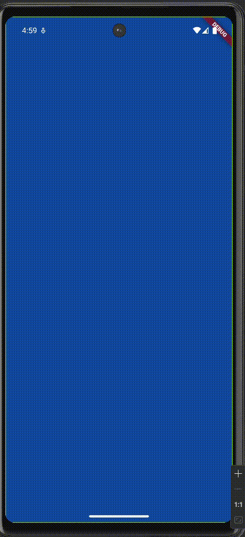

# 🌍 World Time App (Flutter)

A simple Flutter application that fetches and displays the current time for various global locations using the [timeapi.io](https://timeapi.io) API. The app updates its UI based on the time of day (day or night) and allows users to choose a location.

## 🚀 Features

- Real-time time zone data from an external API
- Day/night UI themes based on fetched data
- Location selection using navigation
- Smooth transitions with loading animation
- Fully responsive for Android devices

## 📲 App Demo

<div>
    <p>
      This Flutter app displays world time based on location using <code>timeapi.io</code>.
      It dynamically updates the background to reflect day or night and allows the user
      to edit the selected location via a clean UI.
    </p>
  </div>
<p align="center">
  
</p>

## 🛠 Setup Instructions

### 1. Clone the Repository

```bash
git clone https://github.com/tsidren/world_time_app.git
cd world_time_app
```
### 2. Get the dependencies
```bash
flutter pub get
```
### 3. Ensure Internet permission
In <code>android/app/src/main/AndroidManifest.xml</code> add the following line before the <code><application></code> tag:
```xml
<uses-permission android:name="android.permission.INTERNET"/>
```

## 🧹 Clean the project
Before building the APK, run:
```bash
flutter clean
```

## 📦 Build a release APK
To generate an APK that supports most Android devices:
```bash
flutter build apk --release --target-platform android-arm,android-arm64,android-x64
```
This builds the app for multiple CPU architectures so it can run on real devices.

## 🚗Test Drive
### 1. Creating an Android Emulator
- In the top panel (title bar), you can see the <code>Tool</code> tab. Then open the <code>Device Manager</code>\
or\
In the right panel of tools, you can see these symbols. \
upper one - <code>device manager</code> \
lower one - <code>running devices</code>
- Now add a new device by clicking on the <code>➕</code> icon --> Create a Virtual Device
- Select any of the devices you like, don't choose too old (android version < 7) or the latest versions. Those tend to show errors and are sometimes unstable.
- <code>Finish</code> the setup (the default values will work just fine for this, you can tweak them later)
- Click on the play <code>▶️</code> button. Your emulator will start

### (1. optional) Adding your own phone in for the Emulation
- Turn on the <code>developer options</code>, <code>USB debugging</code> and <code>install via USB</code> in your phone. \
_You can watch a tutorial, it the options can vary on your device and the android version._
- Now connect your phone to your computer using a cable, and turn on file transfer on your phone when it pops up.
- Your phone will show in your <code>device manager</code>. You can start using it as an Emulator.

### 2. Running the app on the emulator
- In the top panel (title bar), you can see the <code>flutter device selection</code> option. (in the middle of the title bar)
- Select your device, which you created just now.
- Now open the <code>main.dart</code> file and run it. (right click in the code editor and click <code>Run 'main.dart'</code>)

You app will take some time loading up the app in the emulator. Wait patiently as the file and dependencies for the app are installing in the emulator.

## 🔧 Notes
- This app uses <code>http</code> package for API calls. Ensure you're handling network errors appropriately.
- Release builds suppress runtime errors, so missing permissions or unhandled exceptions may lead to a blank/grey screen.
- Testing on a real device is recommended for API-related features.

## 📍 API Used
- Base URL:  <code>https://timeapi.io</code>
- Endpoint:
```
https://timeapi.io/api/time/current/zone?timeZone=Asia%2fKolkata
```
---
Made with ❤️ using Flutter.
