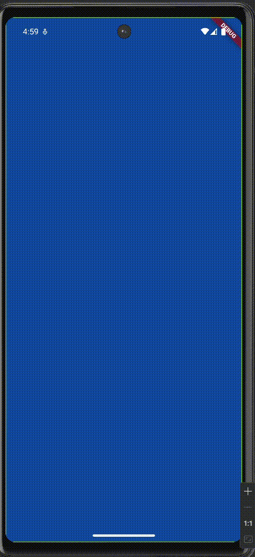

# 🌍 World Time App (Flutter)

A simple Flutter application that fetches and displays the current time for various global locations using the [timeapi.io](https://timeapi.io) API. The app updates its UI based on the time of day (day or night) and allows users to choose a location.


## 🚀 Features

- Real-time time zone data from an external API
- Day/night UI themes based on fetched data
- Location selection using navigation
- Smooth transitions with loading animation
- Fully responsive for Android devices


## 📲 App Demo


<div>
    <p>
      This Flutter app displays world time based on location using <code>timeapi.io</code>.
      It dynamically updates the background to reflect day or night and allows the user
      to edit the selected location via a clean UI.
    </p>
  </div>
<p align="center">
  
</p>

## 🛠 Setup Instructions

### 1. Clone the Repository

```bash
git clone https://github.com/tsidren/world_time_app.git
cd world_time_app
```
### 2. Get the dependencies
```bash
flutter pub get
```
### 3. Ensure Internet permission
In <code>android/app/src/main/AndroidManifest.xml</code> add the following line before the <code><application></code> tag:
```xml
<uses-permission android:name="android.permission.INTERNET"/>
```

## 🧹 Clean the project
Before building the APK, run:
```bash
flutter clean
```

## 📦 Build a release APK
To generate an APK that supports most Android devices:
```bash
flutter build apk --release --target-platform android-arm,android-arm64,android-x64
```
This builds the app for multiple CPU architectures so it can run on real devices.
## 🔧 Notes
- This app uses <code>http</code> package for API calls. Ensure you're handling network errors appropriately.
- Release builds suppress runtime errors — so missing permissions or unhandled exceptions may lead to a blank/grey screen.
- Testing on a real device is recommended for API-related features.
## 📍 API Used
- Base URL:  <code>https://timeapi.io</code>
- Endpoint:
```
https://timeapi.io/api/time/current/zone?timeZone=Asia%2fKolkata
```
---
Made with ❤️ using Flutter.
